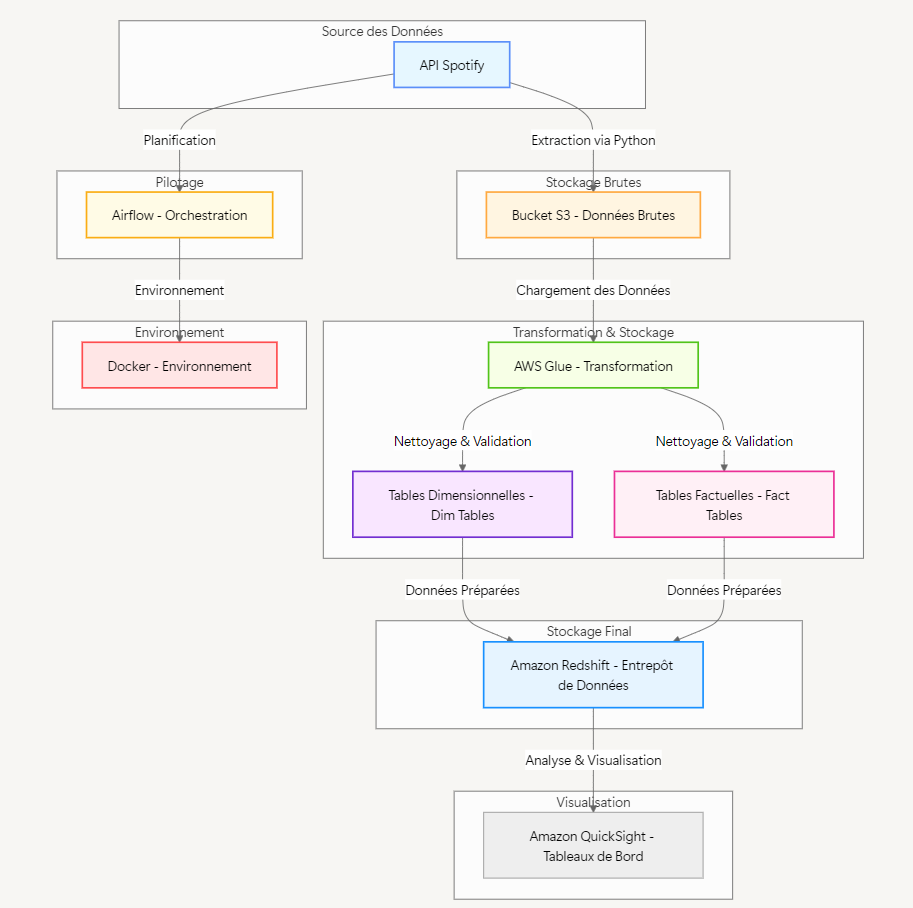

# Spotify ETL Pipeline

## Overview
This project is an **end-to-end ETL pipeline** that extracts data from the Spotify API, transforms it, and loads it into Amazon Redshift for analytics and visualization. The pipeline is orchestrated using **Airflow** and runs in a **Docker** environment. The data is modeled using a **star schema** for efficient querying and analysis.

---

## Key Features
- **Data Extraction**: Fetches data from the Spotify API using Python.
- **Data Storage**: Stores raw data in Amazon S3.
- **Data Transformation**: Cleans and transforms data using AWS Glue.
- **Data Modeling**: Implements a **star schema** with:
  - **Fact Table**: `daily_track_ranking`
  - **Dimension Tables**: `tracks` and `artists`
- **Data Loading**: Loads transformed data into Amazon Redshift.
- **Visualization**: Creates dashboards using Amazon QuickSight.

---

## Technologies Used
- **Data Extraction**: Spotify API, Python (requests, pandas)
- **Orchestration**: Airflow, Docker
- **Data Storage**: Amazon S3, Amazon Redshift
- **Data Transformation**: AWS Glue, PySpark
- **Visualization**: Amazon QuickSight

---

## Project Architecture

### Pipeline Workflow
1. **Data Extraction**:
   - Data is extracted from the Spotify API using Python and stored in Amazon S3.
2. **Data Transformation**:
   - Raw data is cleaned and transformed using AWS Glue.
   - The data is modeled into a **star schema** with:
     - **Fact Table**: `daily_track_ranking`
     - **Dimension Tables**: `tracks` and `artists`
3. **Data Loading**:
   - Transformed data is loaded into Amazon Redshift.
4. **Visualization**:
   - Data is visualized using Amazon QuickSight.

**Screenshot**:  

---

### Star Schema
The data is modeled using a **star schema** for efficient querying and analysis. The schema consists of:
- **Fact Table**: `daily_track_ranking`
- **Dimension Tables**: `tracks` and `artists`

---

## Tables

### Fact Table
#### `daily_track_ranking`
- **Description**: Tracks the daily ranking of songs on Spotify.
- **Columns**:
  - `TRACK_ID` (VARCHAR): Unique identifier for the track.
  - `DATE_RANK` (DATE): Date of the ranking.
  - `STREAM_RANK` (INT): Rank of the track on the given date.
  - `ARTIST_ID` (VARCHAR): Unique identifier for the artist.
  - `POPULARITY` (INT): Popularity score of the track.

### Dimension Tables
#### `tracks`
- **Description**: Contains metadata about tracks.
- **Columns**:
  - `TRACK_ID` (VARCHAR): Unique identifier for the track.
  - `TRACK_NAME` (VARCHAR): Name of the track.
  - `DURATION_SEC` (INT): Duration of the track in seconds.
  - `EXPLICIT_BOOL` (BOOLEAN): Indicates if the track contains explicit content.
  - `ALBUM_NAME` (VARCHAR): Name of the album.
  - `REALEASE_DATE` (DATE): Release date of the track.

#### `artists`
- **Description**: Contains metadata about artists.
- **Columns**:
  - `ARTIST_ID` (VARCHAR): Unique identifier for the artist.
  - `ARTIST_NAME` (VARCHAR): Name of the artist.
  - `GENRES` (VARCHAR): Genres associated with the artist.
  - `FOLLOWERS` (INT): Number of followers on Spotify.
  - `ARTIST_POPULARITY` (INT): Popularity score of the artist.

---
